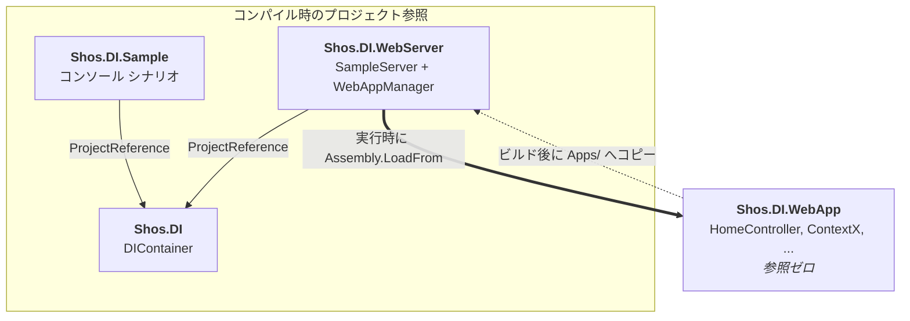
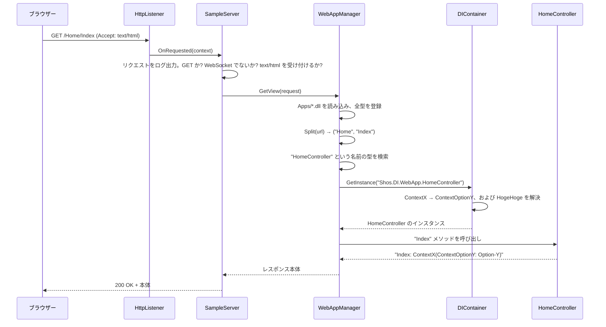

# Shos.DI

> English version: [README.md](README.md)

**Shos.DI** は、DI (Dependency Injection: 依存性の注入) の仕組みを理解するために、.NET 用の DI コンテナをゼロから実装したものです。実用的なコンテナと張り合うことを目的としたものではなく、「DI とは内部で何をやっているのか」を説明するためのコードです。

コンテナ本体はたった 1 ファイル — [`Shos.DI/DIContainer.cs`](Shos.DI/DIContainer.cs) — に収まっています。そしてこのソリューションでは、そのコンテナを使って小さな Web サーバーと小さな MVC アプリケーションを組み立てています。これにより、ASP.NET Core のような実際のフレームワークが、どこでサービス登録を行い、どこでコントローラーを生成し、どこでコンストラクター インジェクションを実行しているのかを、目で追えるようになっています。

---

## 目次

- [このリポジトリの目的](#このリポジトリの目的)
- [プロジェクト構成](#プロジェクト構成)
- [アーキテクチャ](#アーキテクチャ)
- [コンテナの仕組み](#コンテナの仕組み)
- [Shos.DI.Sample — コンソール アプリでの DI](#shosdisample--コンソール-アプリでの-di)
- [Shos.DI.WebServer と Shos.DI.WebApp — ミニチュア版 ASP.NET Core](#shosdiwebserver-と-shosdiwebapp--ミニチュア版-aspnet-core)
- [はじめに](#はじめに)
- [各プロジェクトの実行方法](#各プロジェクトの実行方法)
- [使用技術](#使用技術)
- [制限事項](#制限事項)
- [作者](#作者)
- [ライセンス](#ライセンス)

---

## このリポジトリの目的

ASP.NET Core で、次のようなコントローラーを書いたとします。

```csharp
public class HomeController(MyDbContext context, IClock clock) : Controller
{
    // ...
}
```

このとき、誰かがこのコンストラクターを覗き込み、「`MyDbContext` と `IClock` が必要だ」と判断し、それらのオブジェクトを (さらに *その* 依存関係も再帰的に辿りながら) 生成し、そのうえでようやくコントローラーを生成しています。この「誰か」が DI コンテナであり、フレームワークはリクエストごとにこれを呼び出しています。

Shos.DI は、その仕組みを約 180 行の C# で実装しています。そのうえで手書きの Web サーバーに組み込むことで、*HTTP リクエスト → ルーティング → コントローラーの型 → コンストラクター インジェクション → アクションの呼び出し → HTTP レスポンス* という一連の流れ全体を、フレームワークの魔法に遮られることなく観察できるようにしています。

---

## プロジェクト構成

| プロジェクト | 種類 | 役割 |
| --- | --- | --- |
| [**Shos.DI**](Shos.DI) | クラス ライブラリ | DI コンテナ本体。リフレクションによる型の登録と、再帰的なコンストラクター インジェクション。他への依存は一切ありません。 |
| [**Shos.DI.Sample**](Shos.DI.Sample) | コンソール アプリ | コンテナを直接使う 4 つの短いシナリオ。API を理解する最短ルートです。 |
| [**Shos.DI.WebServer**](Shos.DI.WebServer) | コンソール アプリ (サーバー) | `HttpListener` 上に構築した最小構成の HTTP サーバーと、最小構成の MVC 風ディスパッチャー。Kestrel + ルーティング + コントローラー生成の役割を担います。 |
| [**Shos.DI.WebApp**](Shos.DI.WebApp) | クラス ライブラリ (プラグイン) | サンプルの「Web アプリケーション」。コントローラーとその依存関係のみで構成され、`Shos.DI.WebServer` から **実行時に** 読み込まれます。 |

---

## アーキテクチャ



この図で注目すべきなのは、そこに **描かれていないもの** です。`Shos.DI.WebApp` はプロジェクト参照を 1 つも持っていません — `Shos.DI` すら参照していないのです。コンテナのこともサーバーのことも何も知らない、ただのクラス ライブラリです。サーバーは実行時に `Apps` フォルダーを走査して `.dll` を見つけ出します。これはプラグイン ホスト (あるいは、アプリケーション アセンブリを読み込むフレームワーク) がやっていることと同じです。

これが Web サンプルの最大の学びどころです。すなわち、**アプリケーションは DI コンテナの存在を知らなくてよい**ということ。アプリはコンストラクターで必要なものを宣言するだけで、あとはホストが面倒を見ます。

---

## コンテナの仕組み

以下の内容はすべて [`Shos.DI/DIContainer.cs`](Shos.DI/DIContainer.cs) にあります。

### 公開 API

```csharp
public class DIContainer
{
    // コンテナがその型を生成してよいように登録する
    public void Register<T>();
    public void Register(Type type);
    public bool Register(string typeName);                  // 型名による遅延バインド

    // インスタンスを解決する (依存関係は再帰的に生成される)
    public object? GetInstance<T>();
    public object? GetInstance(string typeName);            // 型名による遅延バインド

    // 解決する。ただし一部のコンストラクター引数は自分で渡す
    public object? GetInstance<T>(params object[] parameters);
    public object? GetInstance(string typeName, params object[] parameters);
}
```

### 依存関係の解決アルゴリズム

`GetInstance(Type)` がこのコンテナの心臓部です。

```csharp
object? GetInstance(Type type)
{
    if (typeInformations.TryGetValue(type, out var typeInformation)) {
        var instance = typeInformation.GetInstance();          // (1) キャッシュ / 引数なし
        if (instance is not null)
            return instance;

        foreach (var constructor in typeInformation.Constructors) {   // (2) 各コンストラクターを試す
            var parameterTypes = typeInformation[constructor];
            if (parameterTypes is null)
                continue;
            var parameters = parameterTypes.Select(GetInstance).ToArray();  // (3) 再帰!
            if (parameters.Any(parameter => parameter is null))
                continue;                                     // (4) 解決不能 — 次を試す
            return constructor.Invoke(parameters);
        }
    }
    return type.GetInstance();                                 // (5) 未登録の型のフォールバック
}
```

順に見ていきます。

1. **キャッシュの参照。** `TypeInformation` は、すでに生成したインスタンスを (使用したコンストラクターのシグネチャをキーに) キャッシュします。したがって登録済みの型は、1 つのコンテナ内では実質的にシングルトンとして振る舞います。
2. **コンストラクターの列挙。** すべての public コンストラクターが候補になります。`Type.GetConstructors()` で一度だけ取得してキャッシュされます。
3. **再帰的な解決。** 各パラメーターの型は、`GetInstance` を再度呼ぶことで解決されます。これが、平坦な `Register` 呼び出しの羅列を、オブジェクト グラフ全体へと変えている仕掛けです。
4. **穏やかなフォールバック。** どれか 1 つでもパラメーターを生成できなければ、そのコンストラクターは飛ばして次を試します。実用的なコンテナが採用している「引数を満たせる最も引数の多いコンストラクターを選ぶ」というルールの簡易版です。
5. **未登録の型。** 一度も登録されていない型にも、まだチャンスがあります。`Type.GetConstructor([])?.Invoke([])`、つまり引数なしでの生成です。コンソール サンプルの `Coo` を見てください。登録されていないにもかかわらず生成されます。`Boo2` が必要としており、かつ既定のコンストラクターを持っているからです。

### 型名による解決

```csharp
static Type? ToType(string typeName)
    => AppDomain.CurrentDomain.GetAssemblies().Select(assembly => assembly.GetType(typeName))
                                              .FirstOrDefault(type => type is not null);
```

この小さなヘルパーが、`Register("Foo")` や `GetInstance("Shos.DI.WebApp.HomeController")` を成立させています。読み込み済みのすべてのアセンブリから、名前の一致する型を探します — 直前に動的に読み込まれたアセンブリも含めてです。Web サーバーは、コンパイル時には存在すら知らなかったコントローラーを生成するために、まさにこれに依存しています。

---

## Shos.DI.Sample — コンソール アプリでの DI

[`Shos.DI.Sample/Program.cs`](Shos.DI.Sample/Program.cs) では、小さな依存関係グラフを定義しています。

```
Foo(Boo2, Boo3)
 ├─ Boo2(Coo)
 │   └─ Coo()
 └─ Boo3(Boo1)
     └─ Boo1()
```

各コンストラクターが自分の名前を出力するようになっているため、コンソール出力がそのまま解決順序のトレースになります。

**Case 1 — ジェネリック型引数による解決。** 部品を登録して、ルートを要求します。

```csharp
var container = new DIContainer();

container.Register<Boo1>();
container.Register<Boo2>();
container.Register<Boo3>();
container.Register<Foo>();

var foo = container.GetInstance<Foo>();   // Boo2, Boo3, Coo, Boo1 がすべて自動生成される
```

**Case 2 — 型名による解決。** 同じことを、完全に遅延バインドで行います。

```csharp
container.Register(nameof(Foo));
var foo = container.GetInstance(nameof(Foo));
```

**Case 3・Case 4 — 引数を自分で渡す。** 登録するのは `Foo` だけで、その依存関係は直接渡します。コンテナは一致するコンストラクターを選ぶだけです。

```csharp
container.Register<Foo>();
var foo = container.GetInstance<Foo>(new Boo2(new Coo()), new Boo3(new Boo1()));
```

4 つのケースはすべて同じグラフを生成します。それがまさに要点です — *やり方* は変わっても、結果は変わりません。

```
■ Case 1.
Coo
Boo2(Coo)
Boo1
Boo3(Boo1)
Foo(Boo2, Boo3)
Foo
```

深さ優先の順序になっていることに注目してください。`Coo` は `Boo2` より先に生成されます。依存先が存在しないうちは `Boo2` を生成できないからです。

---

## Shos.DI.WebServer と Shos.DI.WebApp — ミニチュア版 ASP.NET Core

ここがこのリポジトリでじっくり読む価値のある部分です。この 2 つのプロジェクトは、わずか 3 ファイル・約 200 行で、ASP.NET Core のうち「多くの開発者が毎日使っているが、中身を覗くことはめったにない」部分を再実装しています。

### 対応関係

| ASP.NET Core | Shos.DI での相当物 | ファイル |
| --- | --- | --- |
| `WebApplication.Run()` とホストのライフタイム | `Program.Main` → `server.Start(...)` → `q` の入力待ち | [`Shos.DI.WebServer/Program.cs`](Shos.DI.WebServer/Program.cs) |
| Kestrel (HTTP サーバー) | `System.Net.HttpListener` をラップした `SampleServer` | [`Shos.DI.WebServer/Server.cs`](Shos.DI.WebServer/Server.cs) |
| ミドルウェア パイプライン | `ProcessGetRequest` — 明示的に並んだ処理の列 | [`Shos.DI.WebServer/Server.cs`](Shos.DI.WebServer/Server.cs) |
| リクエスト ログ出力のミドルウェア | `Log(request)` / `Log(response)` | [`Shos.DI.WebServer/Server.cs`](Shos.DI.WebServer/Server.cs) |
| 開発者例外ページ | `ReturnInternalError` — 500 と例外の内容を返す | [`Shos.DI.WebServer/Server.cs`](Shos.DI.WebServer/Server.cs) |
| アプリケーション パーツ / アセンブリの探索 | `Directory.GetFiles("Apps")` + `Assembly.LoadFrom` | [`Shos.DI.WebServer/WebAppManager.cs`](Shos.DI.WebServer/WebAppManager.cs) |
| `builder.Services.Add…` (サービス登録) | `types.ToList().ForEach(container.Register)` | [`Shos.DI.WebServer/WebAppManager.cs`](Shos.DI.WebServer/WebAppManager.cs) |
| `{controller}/{action}` のルート テンプレート | `Split(Uri)` | [`Shos.DI.WebServer/WebAppManager.cs`](Shos.DI.WebServer/WebAppManager.cs) |
| コントローラーの生成 (コンストラクター インジェクション) | `container.GetInstance(controllerType.FullName)` | [`Shos.DI.WebServer/WebAppManager.cs`](Shos.DI.WebServer/WebAppManager.cs) |
| アクションの呼び出しと結果のレンダリング | `action.Invoke(controller, [])` → レスポンス本体 | [`Shos.DI.WebServer/WebAppManager.cs`](Shos.DI.WebServer/WebAppManager.cs) |
| 自分の MVC アプリケーション アセンブリ | `Shos.DI.WebApp` | [`Shos.DI.WebApp/HomeController.cs`](Shos.DI.WebApp/HomeController.cs) |

### リクエスト処理の流れ



### 1. ホスティング — `Program.cs`

```csharp
static void Main()
{
    try {
        using var server = new SampleServer();
        server.Start("http://+:8080/", "https://+:44301/");
        Wait();                       // 'q' が押されるまでブロック
    } catch (Exception e) {
        Console.WriteLine($"Error: {e}");
    }
}
```

これは `WebApplication.Run()` を本質だけに削ぎ落としたものです。サーバーを生成し、URL プレフィックスにバインドし、あとはプロセスを生かし続けるだけ。`+` は `HttpListener` のワイルドカード ホスト指定で、ASP.NET Core の URL 設定における `http://*:8080` に相当します。

### 2. HTTP サーバー — `Server.cs`

`SampleServer` は `HttpListener` と、非同期の受付ループを保持しています。リクエストが届くとすぐに自分自身を再武装するため、リクエストを並行して処理できます。

```csharp
void OnRequested(IAsyncResult result)
{
    if (!listener.IsListening)
        return;

    HttpListenerContext context = listener.EndGetContext(result);
    listener.BeginGetContext(OnRequested, listener);   // ただちに次のリクエストの受付を開始
    // ...
}
```

`ProcessGetRequest` がパイプラインです。ASP.NET Core であれば `app.Use…` のデリゲートを連鎖させるところですが、ここでは各段階が単なる逐次的な文として並んでいます。そのおかげで、パイプラインの「かたち」が非常に見やすくなっています。

```csharp
bool ProcessGetRequest(HttpListenerContext context)
{
    var request  = context.Request;
    var response = context.Response;
    Log(request);                                                   // ログ出力の段

    if (!CanAccept(HttpMethod.Get, request.HttpMethod) || request.IsWebSocketRequest)
        return false;                                               // メソッド / プロトコルのフィルター

    var content         = GetContent(request);                      // エンドポイントの段 (MVC)
    response.StatusCode = (int)(content is null ? HttpStatusCode.NotFound : HttpStatusCode.OK);

    using (var writer = new StreamWriter(response.OutputStream, Encoding.UTF8))
        writer.WriteLine(content ?? "Not Found.");

    response.Close();
    Log(response);                                                  // ログ出力の段
    return true;
}
```

コンテンツ ネゴシエーションは 1 行です。クライアントが実際に HTML を求めている場合にのみ、サーバーはリクエストを MVC 層へ引き渡します。

```csharp
protected virtual string? GetContent(HttpListenerRequest request)
    => request.AcceptTypes is not null && request.AcceptTypes.Contains("text/html")
       ? new WebAppManager().GetView(request)
       : null;
```

ブラウザーは `Accept: text/html` を自動的に送ります。`curl` では明示的に指定する必要があります — [各プロジェクトの実行方法](#各プロジェクトの実行方法)を参照してください。

### 3. ルーティング・登録・生成 — `WebAppManager.cs`

このクラス 1 つで、ASP.NET Core が多数のコンポーネントに分けている 3 つの責務を担っています。まず、コンストラクターでの **探索と登録** です。

```csharp
public WebAppManager()
{
    const string appFileEnd    = ".dll";
    const string appFolderName = "Apps";

    var files      = Directory.GetFiles(appFolderName).Where(fileName => fileName.EndsWith(appFileEnd));
    var assemblies = files.Select(Assembly.LoadFrom);
    types          = assemblies.Select(assembly => assembly.GetTypes())
                               .SelectMany(_ => _);
    types.ToList().ForEach(container.Register);   // すべての型が注入可能になる
}
```

これが意図的に無差別であることに注目してください。`Apps` 内の *すべての* アセンブリの *すべての* public な型が登録されます。実用的なコンテナでは明示的な指定が必要です (`builder.Services.AddScoped<IClock, SystemClock>()` など)。全部登録してしまうのは、このサンプルを読みやすく保つための近道です。

次に **ルーティング**。`{controller}/{action}` という規約を、URL の分割で実装しています。

```csharp
static (string controllerName, string actionName) Split(Uri uri)
{
    var uriAbsoluteUri = uri.AbsoluteUri;
    var texts          = uriAbsoluteUri.Split('/').Skip(3).Take(2).ToArray();
    // "http://localhost:8080/Home/Index" → "http:", "", "localhost:8080" を飛ばして → ["Home", "Index"]
    ...
}
```

そして **生成と呼び出し** — DI が実際に起こる部分です。

```csharp
string? GetView(string controllerName, string actionName)
{
    const string controllerSuffix = "Controller";

    var controllerType = types?.FirstOrDefault(type => type.Name == $"{controllerName}{controllerSuffix}");
    if (controllerType is null)
        return null;                                   // → 404

    var controller = container.GetInstance(controllerType.FullName ?? "");   // ← コンストラクター インジェクション
    if (controller is null)
        return null;

    var action = controllerType.GetMethod(actionName);
    return action?.Invoke(controller, []) as string;   // ← 戻り値がレスポンス本体になる
}
```

ASP.NET Core MVC の 3 つの規約が、ここでは 3 行のコードとして目に見えています。`…Controller` というサフィックス、アクション名が public メソッドに対応すること、そしてアクションの戻り値がレスポンスになること。さらに `container.GetInstance(...)` という 1 回の呼び出しが、フレームワークが通常コントローラー生成のために行っているすべてを置き換えています。

### 4. アプリケーション — `Shos.DI.WebApp/HomeController.cs`

```csharp
namespace Shos.DI.WebApp;

public class HomeController(ContextX context, HogeHoge hogeHoge)
{
    readonly ContextX context = context;

    public string Index()  => $"{nameof(Index)}: {context}";
    public string Detail() => $"{nameof(Detail)}: {context}";
}

public class HogeHoge
{}

public class ContextX(ContextOptionY option)
{
    readonly ContextOptionY option = option;

    public override string ToString() => $"{nameof(ContextX)}({nameof(ContextOptionY)}: {option})";
}

public class ContextOptionY
{
    public override string ToString() => $"Option-Y";
}
```

これがアプリケーションの全体です。いくつか押さえておきたい点があります。

- **コンテナも基底クラスも属性も不要。** `HomeController` は `: Controller` を継承しておらず、`[Route]` も付いておらず、`Shos.DI` を参照してもいません。(プライマリ) コンストラクターで必要なものを宣言しているだけです。これが「コンテナを呼ぶのではなく、コンテナに呼ばせる」という原則であり、このプロジェクトが参照ゼロでビルドできる理由です。
- **入れ子になった依存関係。** `HomeController` は `ContextX` を必要とし、`ContextX` は `ContextOptionY` を必要とします。`new ContextOptionY()` と書く箇所はどこにもありません — コンテナが連鎖を辿ります。実際のアプリにおける `DbContext` ← `DbContextOptions` と同じ構図です。
- **使われない依存関係も生成される。** `hogeHoge` は注入されていますが使われていません。解決がコンストラクターのシグネチャだけで決まっていることを確認できる、分かりやすい例になっています。
- **コピーによる配置。** `Shos.DI.WebApp.csproj` には、ビルド後に出力をサーバーの `Apps` フォルダーへコピーするステップがあります。

  ```xml
  <Target Name="PostBuild" AfterTargets="PostBuildEvent">
    <Exec Command="xcopy /s /y /d $(ProjectDir)bin\$(Configuration)\net10.0\* $(SolutionDir)Shos.DI.WebServer\bin\$(Configuration)\net10.0\Apps\" />
  </Target>
  ```

  この `Apps` フォルダーが 2 つのプロジェクト間の唯一の契約であり、両者を結びつけている唯一のものです。

したがって `GET /Home/Index` は次を返します。

```
Index: ContextX(ContextOptionY: Option-Y)
```

…そしてこの文字列は、ルーティング、3 階層のオブジェクト グラフのコンテナによる解決、リフレクションによるアクション呼び出し、レスポンス パイプラインを通り抜けてきたものです。しかもその全工程が、一度に読み切れる分量のコードとして目の前にあります。

---

## はじめに

### 前提条件

- [.NET 10 SDK](https://dotnet.microsoft.com/download/dotnet/10.0) — 全プロジェクトが `net10.0` をターゲットにしています。
- `Shos.DI.WebServer` については **Windows** を推奨します。このプロジェクトには Windows 固有の点が 2 つあります。
  - `+` ワイルドカード プレフィックスを使う `HttpListener` には、管理者権限または URL ACL の予約が必要です。そのため、このプロジェクトには `requireAdministrator` を要求する [`app.manifest`](Shos.DI.WebServer/app.manifest) が含まれています。
  - `Shos.DI.WebApp` のビルド後ステップは `xcopy` を使っています。Linux / macOS では失敗するため、`Apps` への DLL のコピーを手動で行う必要があります (後述)。

  `Shos.DI` と `Shos.DI.Sample` は完全にクロスプラットフォームです。

### クローン

```bash
git clone https://github.com/Fujiwo/Shos.DI.git
cd Shos.DI
```

### ビルド

```bash
dotnet build Shos.DI.sln
```

[`Directory.Build.props`](Directory.Build.props) によってソリューション全体で静的解析が有効になっています (`EnableNETAnalyzers`、`AnalysisLevel = latest-Minimum`)。そのため、通常のビルドでアナライザーの警告が表示されます。

---

## 各プロジェクトの実行方法

### Shos.DI.Sample

```bash
dotnet run --project Shos.DI.Sample
```

[前述](#shosdisample--コンソール-アプリでの-di)の 4 つのシナリオが出力されます。

### Shos.DI.WebServer + Shos.DI.WebApp

サーバーは **カレント ディレクトリからの相対パス** で `Apps` フォルダーを探すため、サーバー自身の出力ディレクトリから起動する必要があります。

Windows では、**管理者として実行した** コマンド プロンプトから:

```cmd
dotnet build Shos.DI.sln
cd Shos.DI.WebServer\bin\Debug\net10.0
Shos.DI.WebServer.exe
```

`dotnet build` の際に `Shos.DI.WebApp` のビルド後コピーも実行されるため、`Apps\Shos.DI.WebApp.dll` はすでに配置されています。Linux / macOS では、先に手動で用意してください。

```bash
dotnet build Shos.DI.sln
mkdir -p Shos.DI.WebServer/bin/Debug/net10.0/Apps
cp Shos.DI.WebApp/bin/Debug/net10.0/*.dll Shos.DI.WebServer/bin/Debug/net10.0/Apps/
cd Shos.DI.WebServer/bin/Debug/net10.0
sudo ./Shos.DI.WebServer
```

起動するとコンソールに次のように表示されます。

```
Listening...
http://+:8080/
https://+:44301/
```

ブラウザーで次の URL を開いてみてください。

| URL | レスポンス |
| --- | --- |
| <http://localhost:8080/Home/Index> | `Index: ContextX(ContextOptionY: Option-Y)` |
| <http://localhost:8080/Home/Detail> | `Detail: ContextX(ContextOptionY: Option-Y)` |
| <http://localhost:8080/Home/Nope> | `Not Found.` (404 — 該当するアクションなし) |
| <http://localhost:8080/Nope/Index> | `Not Found.` (404 — 該当するコントローラーなし) |

すべてのリクエストとレスポンスが、ヘッダーを含めてコンソールにログ出力されます。パイプラインの動きを観察するのに便利です。

`curl` を使う場合は `Accept` ヘッダーを忘れないでください。指定しないと `GetContent` が早期に打ち切られ、404 になります。

```bash
curl -H "Accept: text/html" http://localhost:8080/Home/Index
```

サーバーのコンソールで `q` を押すと終了します。

> **HTTPS について:** `https://+:44301/` プレフィックスは登録されますが、HTTPS リクエストを成功させるには、そのポートに TLS 証明書をバインドしておく必要があります (`netsh http add sslcert …`)。その設定を済ませていない場合は HTTP のエンドポイントを使ってください。

---

## 使用技術

- [.NET 10](https://dotnet.microsoft.com/download/dotnet/10.0) (`net10.0`)
- C# 12 以降 — ファイル スコープ名前空間、プライマリ コンストラクター、コレクション式 (`[]`)、null 許容参照型、暗黙的な using を使用
- `System.Reflection` — コンテナの仕組みのすべて
- `System.Net.HttpListener` — Web サーバーのトランスポート
- サードパーティ パッケージはソリューション全体で一切使用していません

---

## 制限事項

以下はすべて意図的なものです。Shos.DI が何を省いているかを知ることは、`Microsoft.Extensions.DependencyInjection` のような実用的なコンテナが何を提供しているのかを理解することの一部です。

- **インターフェイスと実装のマッピングがない。** 登録も解決も具体的な型に対して行います。`AddScoped<IClock, SystemClock>()` に相当する機能はありません。
- **ライフタイム管理がない。** 登録された型は、コンテナごと・コンストラクターのシグネチャごとにキャッシュされます — おおよそシングルトンです。Transient や Scoped のライフタイムはなく、`IDisposable` の追跡も行いません。
- **循環依存の検出がない。** コンストラクターに循環があると、スタック オーバーフローするまで再帰します。
- **スレッド セーフではない。** 内部の Dictionary に同期処理はありません。
- **`GetInstance` の戻り値は `T` ではなく `object?`。** 呼び出し側でキャストまたはパターン マッチが必要です。
- **失敗が静かである。** 解決できない依存関係は、説明的な例外ではなく `null` になります。
- **Web サーバー**は `GET` のみを処理します。ビュー エンジンもなく (アクションはプレーンな文字列を返します)、モデル バインドも静的ファイルの配信もありません。また、リクエストごとに `WebAppManager` を新規生成するため、`Apps` の走査とコンテナの構築が毎回やり直されます。実際のホストはこれを起動時に 1 回だけ行います。

---

## 作者

Fujio Kojima: 日本のソフトウェア開発者

* Microsoft MVP for Development Tools - Visual C# (Jul. 2005 - Dec. 2014)
* Microsoft MVP for .NET (Jan. 2015 - Oct. 2015)
* Microsoft MVP for Visual Studio and Development Technologies (Nov. 2015 - Jun. 2018)
* Microsoft MVP for Developer Technologies (Nov. 2018 - Jun. 2025)
* [MVP プロフィール](https://mvp.microsoft.com/en-us/PublicProfile/21482 "MVP Profile")
* [ブログ](http://wp.shos.info "ブログ")
* [Web サイト](http://www.shos.info "Web サイト")
* [Twitter](https://twitter.com/Fujiwo)
* [Instagram](https://www.instagram.com/fujiwo/)

## ライセンス

このプロジェクトは MIT ライセンスの下で公開されています。詳細は [LICENSE.txt](LICENSE.txt) を参照してください。

---

**English version:** [README.md](README.md)
