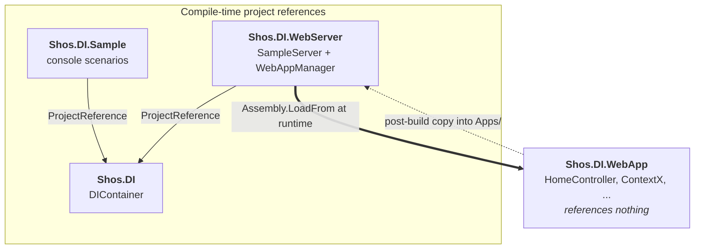

# Shos.DI

**Shos.DI** is a from-scratch Dependency Injection (DI) container for .NET, written to *explain* how DI works rather than to compete with production containers.

The whole container is a single file — [`Shos.DI/DIContainer.cs`](Shos.DI/DIContainer.cs) — and the solution then uses it to build a miniature web server and a miniature MVC application, so you can see exactly where a real framework like ASP.NET Core would perform service registration, controller activation, and constructor injection.

> 日本語版は [README.jp.md](README.jp.md) をご覧ください。

---

## Table of Contents

- [Why this repository exists](#why-this-repository-exists)
- [Projects](#projects)
- [Architecture](#architecture)
- [How the container works](#how-the-container-works)
- [Shos.DI.Sample — DI in a console app](#shosdisample--di-in-a-console-app)
- [Shos.DI.WebServer and Shos.DI.WebApp — a miniature ASP.NET Core](#shosdiwebserver-and-shosdiwebapp--a-miniature-aspnet-core)
- [Getting Started](#getting-started)
- [Running each project](#running-each-project)
- [Built With](#built-with)
- [Limitations](#limitations)
- [Authors](#authors)
- [License](#license)

---

## Why this repository exists

When you write an ASP.NET Core controller like this:

```csharp
public class HomeController(MyDbContext context, IClock clock) : Controller
{
    // ...
}
```

…something has to look at that constructor, work out that it needs a `MyDbContext` and an `IClock`, build those objects (recursively building *their* dependencies), and only then create the controller. That "something" is the DI container, and the framework calls into it for every request.

Shos.DI implements that mechanism in about 180 lines of C#, then wires it into a hand-written web server so you can watch the whole path — *HTTP request → route → controller type → constructor injection → action invocation → HTTP response* — without any framework magic in the way.

---

## Projects

| Project | Kind | Role |
| --- | --- | --- |
| [**Shos.DI**](Shos.DI) | Class library | The DI container itself. Reflection-based type registration and recursive constructor injection. No other dependencies. |
| [**Shos.DI.Sample**](Shos.DI.Sample) | Console app | Four short scenarios that exercise the container directly. The quickest way to understand the API. |
| [**Shos.DI.WebServer**](Shos.DI.WebServer) | Console app (server) | A minimal HTTP server built on `HttpListener`, plus a minimal MVC-style dispatcher. Plays the role of Kestrel + routing + controller activation. |
| [**Shos.DI.WebApp**](Shos.DI.WebApp) | Class library (plugin) | A sample "web application" — a controller and its dependency graph. Loaded **at runtime** by `Shos.DI.WebServer`. |

> **Note:** the repository also contains a `WebApplication1` directory (a stock ASP.NET Core MVC template). It is not part of `Shos.DI.sln` and is not referenced by any of the projects above, so it is not covered by this document.

---

## Architecture



The interesting part of this diagram is what is **missing**: `Shos.DI.WebApp` has *no* project reference — not even to `Shos.DI`. It is a plain class library that knows nothing about the container or the server. The server discovers it at runtime by scanning an `Apps` folder for `.dll` files, exactly the way a plugin host (or a framework loading your application assembly) would.

That is the central lesson of the web sample: **an application should not have to know that a DI container exists.** It just declares its dependencies in constructors; the host does the rest.

---

## How the container works

All of the following lives in [`Shos.DI/DIContainer.cs`](Shos.DI/DIContainer.cs).

### Public API

```csharp
public class DIContainer
{
    // Register a type so the container is allowed to construct it.
    public void Register<T>();
    public void Register(Type type);
    public bool Register(string typeName);                  // late-bound, by type name

    // Resolve an instance, building its dependencies recursively.
    public object? GetInstance<T>();
    public object? GetInstance(string typeName);            // late-bound, by type name

    // Resolve, but supply some constructor arguments yourself.
    public object? GetInstance<T>(params object[] parameters);
    public object? GetInstance(string typeName, params object[] parameters);
}
```

### The resolution algorithm

`GetInstance(Type)` is the heart of the container:

```csharp
object? GetInstance(Type type)
{
    if (typeInformations.TryGetValue(type, out var typeInformation)) {
        var instance = typeInformation.GetInstance();          // (1) cached / parameterless
        if (instance is not null)
            return instance;

        foreach (var constructor in typeInformation.Constructors) {   // (2) try each constructor
            var parameterTypes = typeInformation[constructor];
            if (parameterTypes is null)
                continue;
            var parameters = parameterTypes.Select(GetInstance).ToArray();  // (3) recurse!
            if (parameters.Any(parameter => parameter is null))
                continue;                                     // (4) unsatisfiable — try the next one
            return constructor.Invoke(parameters);
        }
    }
    return type.GetInstance();                                 // (5) unregistered fallback
}
```

Step by step:

1. **Cache lookup.** `TypeInformation` caches instances it has already built (keyed by the constructor signature used), so a registered type is effectively a singleton within one container.
2. **Constructor enumeration.** Every public constructor is a candidate, discovered once via `Type.GetConstructors()` and cached.
3. **Recursive resolution.** Each parameter type is resolved by calling `GetInstance` again. This is what turns a flat list of `Register` calls into a full object graph.
4. **Graceful fallback.** If any parameter cannot be produced, that constructor is skipped and the next one is tried — a simple version of the "greediest constructor that can be satisfied" rule real containers use.
5. **Unregistered types.** A type that was never registered still gets one chance: `Type.GetConstructor([])?.Invoke([])`, i.e. parameterless construction. Look at `Coo` in the console sample — it is never registered, yet it is created, because `Boo2` needs it and it has a default constructor.

### Resolving types by name

```csharp
static Type? ToType(string typeName)
    => AppDomain.CurrentDomain.GetAssemblies().Select(assembly => assembly.GetType(typeName))
                                              .FirstOrDefault(type => type is not null);
```

This small helper is what makes `Register("Foo")` and `GetInstance("Shos.DI.WebApp.HomeController")` work. It searches every loaded assembly for a matching type name — including assemblies that were loaded dynamically a moment earlier. The web server depends on exactly this to activate controllers it had never heard of at compile time.

---

## Shos.DI.Sample — DI in a console app

[`Shos.DI.Sample/Program.cs`](Shos.DI.Sample/Program.cs) defines a small dependency graph:

```
Foo(Boo2, Boo3)
 ├─ Boo2(Coo)
 │   └─ Coo()
 └─ Boo3(Boo1)
     └─ Boo1()
```

Every constructor prints its own name, so the console output *is* the trace of the resolution order.

**Case 1 — resolve by generic type argument.** Register the parts, ask for the root:

```csharp
var container = new DIContainer();

container.Register<Boo1>();
container.Register<Boo2>();
container.Register<Boo3>();
container.Register<Foo>();

var foo = container.GetInstance<Foo>();   // Boo2, Boo3, Coo, Boo1 all built automatically
```

**Case 2 — resolve by type name.** The same thing, entirely late-bound:

```csharp
container.Register(nameof(Foo));
var foo = container.GetInstance(nameof(Foo));
```

**Cases 3 and 4 — supply arguments yourself.** Only `Foo` is registered; its dependencies are handed in directly, so the container just picks the matching constructor:

```csharp
container.Register<Foo>();
var foo = container.GetInstance<Foo>(new Boo2(new Coo()), new Boo3(new Boo1()));
```

All four cases produce the same graph, which is the point — the *how* changes, the result does not:

```
■ Case 1.
Coo
Boo2(Coo)
Boo1
Boo3(Boo1)
Foo(Boo2, Boo3)
Foo
```

Note the depth-first order: `Coo` is constructed before `Boo2`, because `Boo2` cannot exist until its dependency does.

---

## Shos.DI.WebServer and Shos.DI.WebApp — a miniature ASP.NET Core

This is the part of the repository worth reading slowly. Between them, these two projects re-implement — in three small files and about 200 lines — the pieces of ASP.NET Core that most developers use every day but rarely see the inside of.

### What maps to what

| ASP.NET Core | Shos.DI equivalent | File |
| --- | --- | --- |
| `WebApplication.Run()` and host lifetime | `Program.Main` → `server.Start(...)` → wait for `q` | [`Shos.DI.WebServer/Program.cs`](Shos.DI.WebServer/Program.cs) |
| Kestrel (the HTTP server) | `SampleServer` wrapping `System.Net.HttpListener` | [`Shos.DI.WebServer/Server.cs`](Shos.DI.WebServer/Server.cs) |
| The middleware pipeline | `ProcessGetRequest` — an explicit sequence of checks | [`Shos.DI.WebServer/Server.cs`](Shos.DI.WebServer/Server.cs) |
| Request logging middleware | `Log(request)` / `Log(response)` | [`Shos.DI.WebServer/Server.cs`](Shos.DI.WebServer/Server.cs) |
| Developer exception page | `ReturnInternalError` — 500 plus the exception text | [`Shos.DI.WebServer/Server.cs`](Shos.DI.WebServer/Server.cs) |
| Application parts / assembly discovery | `Directory.GetFiles("Apps")` + `Assembly.LoadFrom` | [`Shos.DI.WebServer/WebAppManager.cs`](Shos.DI.WebServer/WebAppManager.cs) |
| `builder.Services.Add…` (service registration) | `types.ToList().ForEach(container.Register)` | [`Shos.DI.WebServer/WebAppManager.cs`](Shos.DI.WebServer/WebAppManager.cs) |
| The `{controller}/{action}` route template | `Split(Uri)` | [`Shos.DI.WebServer/WebAppManager.cs`](Shos.DI.WebServer/WebAppManager.cs) |
| Controller activation (constructor injection) | `container.GetInstance(controllerType.FullName)` | [`Shos.DI.WebServer/WebAppManager.cs`](Shos.DI.WebServer/WebAppManager.cs) |
| Action invocation and result rendering | `action.Invoke(controller, [])` → response body | [`Shos.DI.WebServer/WebAppManager.cs`](Shos.DI.WebServer/WebAppManager.cs) |
| Your MVC application assembly | `Shos.DI.WebApp` | [`Shos.DI.WebApp/HomeController.cs`](Shos.DI.WebApp/HomeController.cs) |

### The request pipeline

```mermaid
sequenceDiagram
    participant B as Browser
    participant L as HttpListener
    participant S as SampleServer
    participant M as WebAppManager
    participant C as DIContainer
    participant H as HomeController

    B->>L: GET /Home/Index (Accept: text/html)
    L->>S: OnRequested(context)
    S->>S: log request; GET? not a WebSocket? Accept text/html?
    S->>M: GetView(request)
    M->>M: load Apps/*.dll, register every type
    M->>M: Split(url) → ("Home", "Index")
    M->>M: find type named "HomeController"
    M->>C: GetInstance("Shos.DI.WebApp.HomeController")
    C->>C: resolve ContextX → ContextOptionY, and HogeHoge
    C-->>M: HomeController instance
    M->>H: Invoke the "Index" method
    H-->>M: "Index: ContextX(ContextOptionY: Option-Y)"
    M-->>S: response body
    S-->>B: 200 OK + body
```

### 1. Hosting — `Program.cs`

```csharp
static void Main()
{
    try {
        using var server = new SampleServer();
        server.Start("http://+:8080/", "https://+:44301/");
        Wait();                       // block until the user presses 'q'
    } catch (Exception e) {
        Console.WriteLine($"Error: {e}");
    }
}
```

This is `WebApplication.Run()` stripped to its essence: create the server, bind it to some URL prefixes, then keep the process alive. `+` is `HttpListener`'s wildcard host, the counterpart of `http://*:8080` in ASP.NET Core's URL configuration.

### 2. The HTTP server — `Server.cs`

`SampleServer` owns an `HttpListener` and an asynchronous accept loop. Each time a request arrives it immediately re-arms itself, so requests can overlap:

```csharp
void OnRequested(IAsyncResult result)
{
    if (!listener.IsListening)
        return;

    HttpListenerContext context = listener.EndGetContext(result);
    listener.BeginGetContext(OnRequested, listener);   // accept the next request right away
    // ...
}
```

`ProcessGetRequest` is the pipeline. Where ASP.NET Core would chain `app.Use…` delegates, here the stages are just sequential statements — which makes the shape of a pipeline unusually easy to see:

```csharp
bool ProcessGetRequest(HttpListenerContext context)
{
    var request  = context.Request;
    var response = context.Response;
    Log(request);                                                   // logging stage

    if (!CanAccept(HttpMethod.Get, request.HttpMethod) || request.IsWebSocketRequest)
        return false;                                               // method / protocol filter

    var content         = GetContent(request);                      // endpoint stage (MVC)
    response.StatusCode = (int)(content is null ? HttpStatusCode.NotFound : HttpStatusCode.OK);

    using (var writer = new StreamWriter(response.OutputStream, Encoding.UTF8))
        writer.WriteLine(content ?? "Not Found.");

    response.Close();
    Log(response);                                                  // logging stage
    return true;
}
```

Content negotiation is a single line — the server only hands a request to the MVC layer if the client actually wants HTML:

```csharp
protected virtual string? GetContent(HttpListenerRequest request)
    => request.AcceptTypes is not null && request.AcceptTypes.Contains("text/html")
       ? new WebAppManager().GetView(request)
       : null;
```

A browser sends `Accept: text/html` automatically. With `curl` you have to ask for it explicitly — see [Running each project](#running-each-project).

### 3. Routing, registration, and activation — `WebAppManager.cs`

This single class covers three responsibilities that ASP.NET Core splits across many. First, **discovery and registration** in the constructor:

```csharp
public WebAppManager()
{
    const string appFileEnd    = ".dll";
    const string appFolderName = "Apps";

    var files      = Directory.GetFiles(appFolderName).Where(fileName => fileName.EndsWith(appFileEnd));
    var assemblies = files.Select(Assembly.LoadFrom);
    types          = assemblies.Select(assembly => assembly.GetTypes())
                               .SelectMany(_ => _);
    types.ToList().ForEach(container.Register);   // every type becomes injectable
}
```

Notice that this is deliberately indiscriminate: *every* public type in *every* assembly in `Apps` is registered. Real containers require you to be explicit (`builder.Services.AddScoped<IClock, SystemClock>()`); registering everything is the shortcut that lets this sample stay readable.

Second, **routing**. The `{controller}/{action}` convention, implemented by splitting the URL:

```csharp
static (string controllerName, string actionName) Split(Uri uri)
{
    var uriAbsoluteUri = uri.AbsoluteUri;
    var texts          = uriAbsoluteUri.Split('/').Skip(3).Take(2).ToArray();
    // "http://localhost:8080/Home/Index" → skip "http:", "", "localhost:8080" → ["Home", "Index"]
    ...
}
```

Third, **activation and invocation** — the step where DI actually happens:

```csharp
string? GetView(string controllerName, string actionName)
{
    const string controllerSuffix = "Controller";

    var controllerType = types?.FirstOrDefault(type => type.Name == $"{controllerName}{controllerSuffix}");
    if (controllerType is null)
        return null;                                   // → 404

    var controller = container.GetInstance(controllerType.FullName ?? "");   // ← constructor injection
    if (controller is null)
        return null;

    var action = controllerType.GetMethod(actionName);
    return action?.Invoke(controller, []) as string;   // ← the return value is the response body
}
```

Three conventions of ASP.NET Core MVC are visible here in three lines: the `…Controller` suffix, the action name mapping to a public method, and the action's return value becoming the response. And `container.GetInstance(...)` is the one call that replaces everything the framework normally does to build a controller.

### 4. The application — `Shos.DI.WebApp/HomeController.cs`

```csharp
namespace Shos.DI.WebApp;

public class HomeController(ContextX context, HogeHoge hogeHoge)
{
    readonly ContextX context = context;

    public string Index()  => $"{nameof(Index)}: {context}";
    public string Detail() => $"{nameof(Detail)}: {context}";
}

public class HogeHoge
{}

public class ContextX(ContextOptionY option)
{
    readonly ContextOptionY option = option;

    public override string ToString() => $"{nameof(ContextX)}({nameof(ContextOptionY)}: {option})";
}

public class ContextOptionY
{
    public override string ToString() => $"Option-Y";
}
```

That is the entire application. A few things are worth pointing out:

- **No container, no base class, no attributes.** `HomeController` is not `: Controller`, has no `[Route]`, and does not reference `Shos.DI`. It only declares what it needs in its (primary) constructor. This is the "don't call the container, let the container call you" principle, and it is why the project compiles with zero references.
- **Nested dependencies.** `HomeController` needs `ContextX`, which needs `ContextOptionY`. Nobody ever writes `new ContextOptionY()` — the container walks the chain. Compare `DbContext` ← `DbContextOptions` in a real app.
- **Unused dependencies still get built.** `hogeHoge` is injected and ignored, which is a handy way to see that resolution is driven purely by the constructor signature.
- **Deployment by copy.** `Shos.DI.WebApp.csproj` has a post-build step that copies its output into the server's `Apps` folder:

  ```xml
  <Target Name="PostBuild" AfterTargets="PostBuildEvent">
    <Exec Command="xcopy /s /y /d $(ProjectDir)bin\$(Configuration)\net10.0\* $(SolutionDir)Shos.DI.WebServer\bin\$(Configuration)\net10.0\Apps\" />
  </Target>
  ```

  That `Apps` folder is the contract between the two projects — the only thing connecting them.

So `GET /Home/Index` returns:

```
Index: ContextX(ContextOptionY: Option-Y)
```

…and that string travelled through routing, container resolution of a three-level object graph, reflection-based action invocation, and the response pipeline — all of it visible in code you can read in one sitting.

---

## Getting Started

### Prerequisites

- [.NET 10 SDK](https://dotnet.microsoft.com/download/dotnet/10.0) — every project targets `net10.0`.
- **Windows** is recommended for `Shos.DI.WebServer`. Two things in that project are Windows-specific:
  - `HttpListener` with `+` wildcard prefixes requires either administrator rights or a URL ACL reservation. The project therefore ships an [`app.manifest`](Shos.DI.WebServer/app.manifest) requesting `requireAdministrator`.
  - The `Shos.DI.WebApp` post-build step uses `xcopy`. On Linux/macOS it will fail, and you need to copy the DLLs into `Apps` yourself (see below).

  `Shos.DI` and `Shos.DI.Sample` are fully cross-platform.

### Clone

```bash
git clone https://github.com/Fujiwo/Shos.DI.git
cd Shos.DI
```

### Build

```bash
dotnet build Shos.DI.sln
```

Static analysis is enabled solution-wide from [`Directory.Build.props`](Directory.Build.props) (`EnableNETAnalyzers`, `AnalysisLevel = latest-Minimum`), so analyzer warnings surface during a normal build.

---

## Running each project

### Shos.DI.Sample

```bash
dotnet run --project Shos.DI.Sample
```

Prints the four scenarios described [above](#shosdisample--di-in-a-console-app).

### Shos.DI.WebServer + Shos.DI.WebApp

The server loads its application from an `Apps` folder **relative to the current working directory**, so you need to start it from its own output directory.

On Windows, from an **elevated** (Administrator) prompt:

```cmd
dotnet build Shos.DI.sln
cd Shos.DI.WebServer\bin\Debug\net10.0
Shos.DI.WebServer.exe
```

The `dotnet build` step also runs `Shos.DI.WebApp`'s post-build copy, so `Apps\Shos.DI.WebApp.dll` will already be in place. On Linux/macOS, create it manually first:

```bash
dotnet build Shos.DI.sln
mkdir -p Shos.DI.WebServer/bin/Debug/net10.0/Apps
cp Shos.DI.WebApp/bin/Debug/net10.0/*.dll Shos.DI.WebServer/bin/Debug/net10.0/Apps/
cd Shos.DI.WebServer/bin/Debug/net10.0
sudo ./Shos.DI.WebServer
```

The console then shows:

```
Listening...
http://+:8080/
https://+:44301/
```

Open a browser at:

| URL | Response |
| --- | --- |
| <http://localhost:8080/Home/Index> | `Index: ContextX(ContextOptionY: Option-Y)` |
| <http://localhost:8080/Home/Detail> | `Detail: ContextX(ContextOptionY: Option-Y)` |
| <http://localhost:8080/Home/Nope> | `Not Found.` (404 — no such action) |
| <http://localhost:8080/Nope/Index> | `Not Found.` (404 — no such controller) |

Every request and response, headers included, is logged to the console — useful for watching the pipeline work.

With `curl`, remember the `Accept` header, or `GetContent` will short-circuit to 404:

```bash
curl -H "Accept: text/html" http://localhost:8080/Home/Index
```

Press `q` in the server console to shut down.

> **HTTPS:** the `https://+:44301/` prefix is registered, but `HttpListener` needs a TLS certificate bound to that port (`netsh http add sslcert …`) before HTTPS requests will succeed. Use the HTTP endpoint unless you have set that up.

---

## Built With

- [.NET 10](https://dotnet.microsoft.com/download/dotnet/10.0) (`net10.0`)
- C# 12 or later, using file-scoped namespaces, primary constructors, collection expressions (`[]`), nullable reference types, and implicit usings
- `System.Reflection` — the container's entire mechanism
- `System.Net.HttpListener` — the web server's transport
- No third-party packages anywhere in the solution

---

## Limitations

These are intentional. Knowing what Shos.DI leaves out is part of understanding what a production container such as `Microsoft.Extensions.DependencyInjection` provides:

- **No interface-to-implementation mapping.** You register and resolve concrete types; there is no `AddScoped<IClock, SystemClock>()` equivalent.
- **No lifetime management.** A registered type is cached per container per constructor signature — roughly a singleton. There are no transient or scoped lifetimes, and no `IDisposable` tracking.
- **No circular-dependency detection.** A cycle in your constructors will recurse until the stack overflows.
- **Not thread-safe.** The internal dictionaries are unsynchronised.
- **`GetInstance` returns `object?`,** not `T`, so callers cast or pattern-match.
- **Silent failure.** Unresolvable dependencies yield `null` rather than a descriptive exception.
- **The web server** handles `GET` only, has no view engine (actions return plain strings), no model binding, no static file serving, and builds a fresh `WebAppManager` — and therefore re-scans `Apps` and rebuilds the container — on every request. A real host does that work once at startup.

---

## Authors

Fujio Kojima: a software developer in Japan

* Microsoft MVP for Development Tools - Visual C# (Jul. 2005 - Dec. 2014)
* Microsoft MVP for .NET (Jan. 2015 - Oct. 2015)
* Microsoft MVP for Visual Studio and Development Technologies (Nov. 2015 - Jun. 2018)
* Microsoft MVP for Developer Technologies (Nov. 2018 - Jun. 2025)
* [MVP Profile](https://mvp.microsoft.com/en-us/PublicProfile/21482 "MVP Profile")
* [Blog (Japanese)](http://wp.shos.info "Blog (Japanese)")
* [Web Site (Japanese)](http://www.shos.info "Web Site (Japanese)")
* [Twitter](https://twitter.com/Fujiwo)
* [Instagram](https://www.instagram.com/fujiwo/)

## License

This project is licensed under the MIT License - see the [LICENSE.txt](LICENSE.txt) file for details.

---

**日本語版のドキュメント:** [README.jp.md](README.jp.md)
